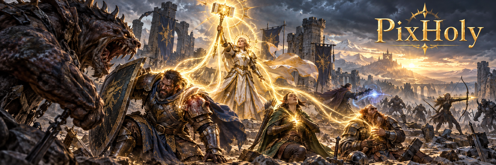

<p align="center">
  
</p>

<h1 align="center">PixHoly</h1>
<p align="center"><strong>烈日奶骑 · 小队治疗 · 像素读取</strong></p>
<p align="center">Lua显示战斗状态，Python动态选择治疗目标，按优先级执行技能。</p>

## 项目简介

PixHoly 是运行在 Windows 上的神圣圣骑士像素循环工具，针对烈日先驱治疗构筑。游戏内插件显示小队状态、圣能、法力、技能、增益和首领信息；桌面程序读取像素，执行一套手写治疗循环。

- **固定五个单位**：玩家与party1–4，支持单人和小队；进入团队仍只处理这五个单位。
- **动态治疗目标**：按生命评分、职责、增益时长与受伤人数选择治疗；驱散按魔法、疾病、中毒顺序处理。
- **读条预测**：记录当前治疗目标，将治疗吸收和本次读条估算纳入评分，普通读条最后0.4秒选择下一技能。
- **首领规则**：支持特定首领的治疗与停止施法窗口。
- **控制与观察**：保留启停、爆发窗口、手动延迟、自动驱散、自动饰品以及施法图标和黑名单观察；不执行自动打断或插入技能。

## 快速开始

使用 Windows、Python 3.13、uv，以及简体中文正式服客户端。当前插件声明 Interface `120100`、版本 `12.1.0.68209`，专精门控为神圣序号1。

```powershell
git clone https://github.com/liantian-cn/PixHoly.git
cd PixHoly
uv sync --python 3.13
uv run python -m pix.main
```

在桌面界面中选择游戏进程，点击**拷贝插件**，将插件安装到 `Interface/AddOns/PixHoly/`，然后在游戏内 `/reload`。
也可以手动将 `pix/lua/` 的全部文件和子目录复制到该目录。设置独立保存在 `PixHolyDB`，不读取其他专精的配置。
先启动截图确认定位，再启动循环。像素基板为716×12物理像素，需要完整显示。

## 治疗与范围

`Context.party` 固定包含五个成员字典，不存在的成员为 `exist=False`。存在、存活、连接、可协助、范围和救赎之魂状态参与候选筛选。
治疗和驱散统一用圣光术82326判定范围，对敌技能统一用制裁之锤853判定范围。
每个定向技能拥有独立的玩家／队友宏，选人后发送对应键位，不切换当前目标。
圣令宏根据已知技能使用永恒之火或荣耀圣令。

生命评分为预测生命百分比减治疗吸收百分比，再加当前读条的治疗估算：圣光术40、圣光闪现15。
真实圣能与读条期间预测增加的1点圣能分开。最低成员可以有负评分，受伤人数只统计正评分成员。
吸收条内容为5个Cell、共20px，完整占6个Cell，精度约5个百分点；伤害吸收仅显示是否存在，不加入评分。
施法事件可识别时确认当前读条目标；目标未知时不添加定向治疗估算。

## 游戏内控制

| 命令／设置 | 用途 |
| --- | --- |
| `/pix toggle` | 切换启停 |
| `/pix disable` | 关闭自动动作 |
| `/pix burst 15` | 开启15秒爆发窗口，传0结束 |
| `/pix delay 0.4` | 手动操作后的暂停窗口 |
| 自动驱散 | 默认开启，按魔法、疾病、中毒顺序处理小队和友方目标 |
| 自动饰品 | 默认开启，战斗中的爆发窗口内，驱散与自身急救之后先用上饰品，再用下饰品 |

药水优先选择有库存且可使用的271884、271883、241304。生命不高于30%时使用药水；不高于20%、药水不可用且圣疗就绪时对自身圣疗。
宏键位与Python动作一一对应，固定 `CTRL-F12` 用于重载。绑定会覆盖对应游戏键位，应避开这些组合进行手动技能设置。

## 目录与验证

| 文件／目录 | 职责 |
| --- | --- |
| `pix/lua/cells/` | 状态、技能、小队与首领像素 |
| `pix/lua/core/units.lua` | 小队集中创建与队伍刷新 |
| `pix/lua/macro.lua` | 固定单位宏及键位 |
| `pix/context.py` | 像素解码和五成员字典 |
| `pix/rotation.py` | 动态选人、预测与治疗优先级 |
| `pix/action.py`、`pix/keyboard.py` | 顺序执行与按键发送 |
| `pix/capture.py`、`pix/matrix.py` | 截图定位与像素区域解析 |
| `layout.md` | 完整位置和编码约定 |

```powershell
uv run pyright pix
uv run python -m compileall pix
git diff --check
uv run python -m pix.test_captura
```

最后一条命令只截图定位，不发送按键。新增Lua行为仍需在游戏中确认：成员加入／离开、吸收条刻度、驱散、读条目标、末段排队以及首领停止窗口。
仓库横幅暂沿用现有图片，新配图提示词见 `docs/assets/hero.prompt.md`。
